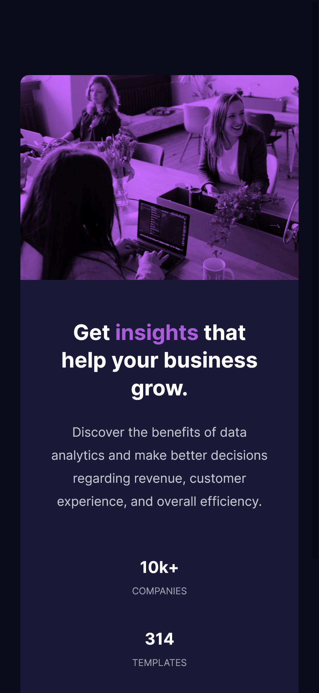
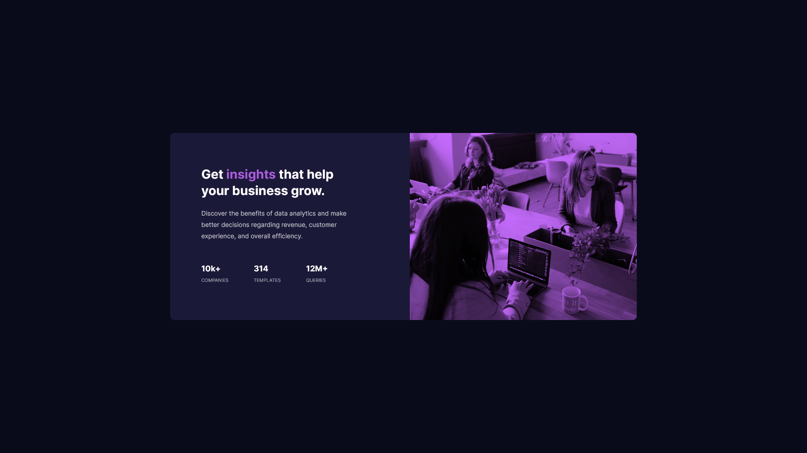

# Frontend Mentor - Stats preview card component solution

This is a solution to the [Stats preview card component challenge on Frontend Mentor](https://www.frontendmentor.io/challenges/stats-preview-card-component-8JqbgoU62). Frontend Mentor challenges help you improve your coding skills by building realistic projects.

## Table of contents

- [Overview](#overview)
  - [The challenge](#the-challenge)
  - [Screenshot](#screenshot)
  - [Links](#links)
- [My process](#my-process)
  - [Built with](#built-with)
  - [What I learned](#what-i-learned)
  - [Continued development](#continued-development)
  - [Useful resources](#useful-resources)
- [Author](#author)
- [Acknowledgments](#acknowledgments)

## Overview

### The challenge

Users should be able to:

- View the optimal layout depending on their device's screen size

### Screenshot

Mobile


Desktop


### Links

- Solution URL: [Add solution URL here](https://your-solution-url.com)
- Live Site URL: [Add live site URL here](https://your-live-site-url.com)

## My process

### Built with

- Semantic HTML5 markup
- Sass
- Flexbox
- CSS Grid
- Mobile-first workflow

### What I learned

I learned the background-blend-mode property. It was very useful for the image.

```scss
.image {
  background-image: url("../images/image-header-mobile.jpg");
  background-color: $softViolet;
  background-blend-mode: multiply;
  background-size: cover;
  background-position: center;
  filter: brightness(1.2);
}
```

## Author

- Frontend Mentor - [@luis-silva-hub](https://www.frontendmentor.io/profile/luis-silva-hub)
- Guthub - [@LuisStiveSilva](https://github.com/LuisStiveSilva)
